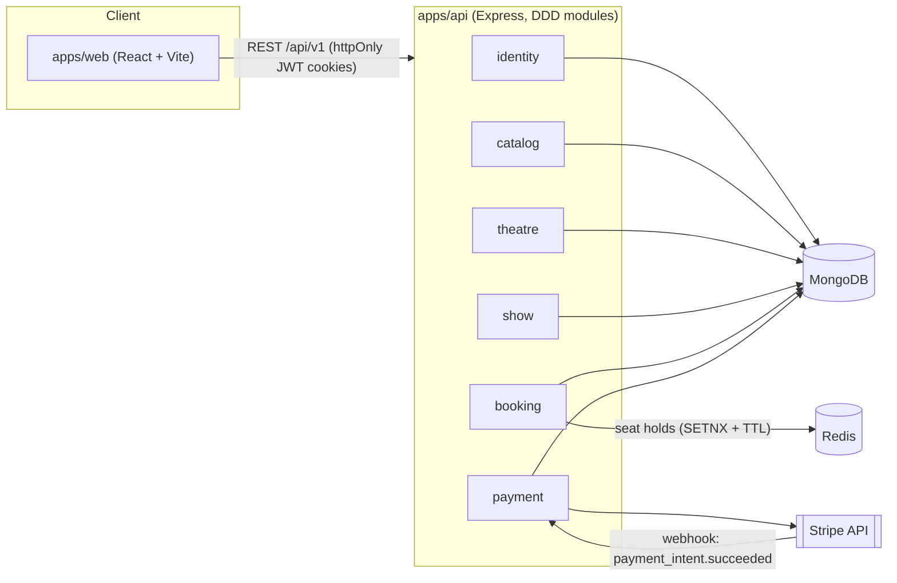

# TicketVerse

TicketVerse is a full-stack movie ticket booking platform, built as an academic MERN-stack
(MongoDB, Express, React, Node.js) project. It supports movie/showtime browsing, seat-map selection
with Redis-backed concurrency-safe holds, Stripe checkout, and role-based dashboards for regular
users, theatre owners, and admins.

## Tech stack

| Layer               | Technology                                                                                                                    |
| ------------------- | ----------------------------------------------------------------------------------------------------------------------------- |
| Frontend            | React 18 + Vite + TypeScript, MUI v6, Redux Toolkit, TanStack React Query, React Router v6, React Hook Form + Zod             |
| Backend             | Node.js + Express + TypeScript, Domain-Driven Design (DDD)-style module layering                                              |
| Database            | MongoDB (Mongoose)                                                                                                            |
| Cache / concurrency | Redis (seat-hold locks with TTL)                                                                                              |
| Payments            | Stripe (test mode) — PaymentIntents + webhook confirmation                                                                    |
| Shared contracts    | `packages/schemas` — Zod schemas shared between frontend and backend, one source of truth for validation and TypeScript types |
| Monorepo tooling    | npm workspaces + Turborepo                                                                                                    |
| Testing             | Vitest, Supertest, mongodb-memory-server, ioredis-mock (backend); Vitest + React Testing Library (frontend)                   |

## Monorepo layout

```
apps/
  api/            Express + TS backend (DDD-style modules)
  web/            React + Vite + TS frontend
packages/
  schemas/        Shared Zod schemas + inferred TS types (@ticketverse/schemas)
  config/         Shared tsconfig base + ESLint/Prettier config (@ticketverse/config)
turbo.json        Turborepo pipeline definitions (build/dev/lint/test/typecheck)
```

Each app/package is documented in more depth in its own README:

- [apps/api/README.md](apps/api/README.md) — backend architecture, env vars, API routes, security, tests
- [apps/web/README.md](apps/web/README.md) — frontend structure, env vars, routes, tests

## Architecture overview



## Roles

- **user** (default) — browses movies/showtimes, books seats, pays, views own booking history.
- **theatre_owner** — manages their own theatres/screens and schedules shows for existing movies
  (cannot add new movies to the catalog). Elevated from `user` via an admin-approved
  `TheatreOwnerRequest`.
- **admin** — owns the master movie catalog (CRUD), approves/rejects theatre-owner requests, and has
  oversight (read-only) over all users, theatres, and bookings.

## Booking flow

1. `GET /shows/:id/seats` merges confirmed Mongo bookings with live Redis holds into a seat
   availability map.
2. `POST /bookings/hold {showId, seatIds}` takes a short-lived Redis lock (`SETNX` + TTL) per seat;
   if any seat is already held/booked, the whole request is rejected (409) with the conflicting seat
   IDs so the client can let the user pick again.
3. On a successful hold, `POST /bookings` creates a `pending_payment` Booking and a Stripe
   PaymentIntent.
4. The frontend confirms payment via Stripe Elements.
5. Stripe's `payment_intent.succeeded` webhook (signature-verified) confirms the Booking, persists
   the seats as booked, and releases the Redis holds.
6. Abandoned holds expire automatically via Redis TTL.

## Security

- Passwords hashed with bcrypt (12 salt rounds) — plaintext passwords are never stored or logged.
- Auth via short-lived JWT access tokens + longer-lived rotating refresh tokens, both delivered as
  `httpOnly`, `sameSite`, (`secure` in production) cookies — never exposed to client-side JS, which
  mitigates token theft via XSS.
- Refresh tokens are revocable via a `tokenVersion` field on `User` (bumped on logout / role change),
  so a stolen refresh token stops working the moment the user logs out or is promoted.
- `helmet` (secure HTTP headers), `express-rate-limit` (stricter limit on `/auth/login` to blunt
  brute-force attacks), `express-mongo-sanitize` (NoSQL injection protection), and an explicit CORS
  allow-list with `credentials: true`.
- All request bodies/query/params validated at the HTTP boundary via shared Zod schemas.
- Admin/oversight endpoints return explicit safe DTOs (never a raw DB entity), so internal fields
  like `passwordHash` or `tokenVersion` can never leak through the API.
- Stripe webhook signatures are verified before any booking/payment state is mutated.
- Card data never touches our server — Stripe Elements/PaymentIntents handle PCI-scoped data.

## Getting started

### Prerequisites

- Node.js ≥ 20, npm ≥ 11 (see `.nvmrc` / root `package.json#engines`)
- A local MongoDB instance (or Atlas connection string)
- A local Redis instance (or a hosted Redis, e.g. Upstash)
- A Stripe account in test mode (for payment testing — optional for browsing/booking-without-payment
  development)

### Setup

```bash
git clone <repo-url>
cd Scaler
npm install

# Configure environment variables for each app
cp apps/api/.env.example apps/api/.env
cp apps/web/.env.example apps/web/.env
# then edit both .env files — see apps/api/README.md and apps/web/README.md for the full variable
# reference. At minimum, replace the JWT_ACCESS_SECRET/JWT_REFRESH_SECRET placeholders with real
# random strings, and point MONGODB_URI/REDIS_URL at your local or hosted instances.

# Make sure MongoDB and Redis are running locally, e.g.:
#   mongod --dbpath /path/to/data
#   redis-server

npm run dev        # runs both apps/api (port 4000) and apps/web (port 5173) via Turborepo
```

### Try it out with seed data

Populate the database with demo users (one per role), movies, a theatre, and upcoming shows:

```bash
npm run seed --workspace=@ticketverse/api
```

See [apps/api/README.md](apps/api/README.md#seed-data) for the full list of test accounts —
they all share the same password so you can log in immediately as an admin, theatre owner, or
regular user without going through signup/approval first.

### Common scripts (run from the repo root, orchestrated by Turborepo)

| Command             | What it does                                                          |
| ------------------- | --------------------------------------------------------------------- |
| `npm run dev`       | Starts both apps in watch mode                                        |
| `npm run build`     | Builds all packages/apps                                              |
| `npm run lint`      | Lints all packages/apps                                               |
| `npm run typecheck` | Type-checks all packages/apps                                         |
| `npm run test`      | Runs backend (Vitest/Supertest) and frontend (Vitest/RTL) test suites |

Any of these can be scoped to a single package, e.g. `npx turbo run test --filter=@ticketverse/api`.

## Deployment (planned)

Docker was intentionally deferred for this academic project in favor of free-tier hosted services:

- Backend → Render (or similar Node host)
- MongoDB → MongoDB Atlas
- Redis → Upstash or Render Redis
- Frontend → Netlify (or Vercel)
- CORS configured for the deployed frontend origin with `credentials: true`; cookies require
  `sameSite=None; Secure` for cross-site (Netlify↔Render) delivery.
- Stripe webhooks tested locally via the Stripe CLI (`stripe listen --forward-to`), and pointed at
  the deployed backend's webhook URL in production.
